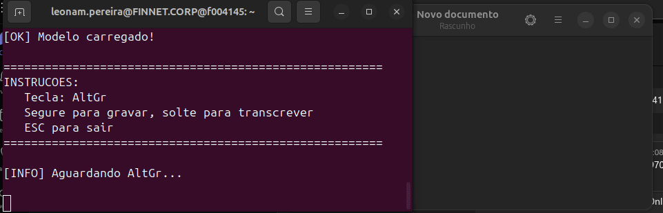

# Push to Task


Ditado por voz *push-to-talk* para Linux usando
reconhecimento offline.

Segure uma tecla, fale e solte --- o texto aparece automaticamente onde
estiver o cursor.

------------------------------------------------------------------------

## 🎬 Demo



------------------------------------------------------------------------

## ✨ Features

-   🎙️ Push-to-talk (segurar para falar)
-   🔒 100% offline
-   ⌨️ Tecla configurável
-   📋 Auto paste no campo ativo

------------------------------------------------------------------------

## 🧩 Como funciona?

\[ Segura tecla \] → \[ Grava áudio \] → \[ Transcrição offline (Vosk)
\] → \[ Copia para clipboard \] → \[ Cola automaticamente \]

Fluxo:

1.  Segure a tecla configurada\
2.  Fale normalmente\
3.  Solte a tecla\
4.  O texto é transcrito e colado automaticamente

------------------------------------------------------------------------

## 📦 Instalação

``` bash
chmod +x install.sh
./install.sh
```

O instalador:

-   instala dependências
-   cria virtualenv
-   baixa modelo PT-BR (\~1.6GB)
-   configura tecla de ativação

------------------------------------------------------------------------

## 🚀 Uso

Iniciar:

``` bash
dictation
```

Reconfigurar tecla:

``` bash
dictation-config
```